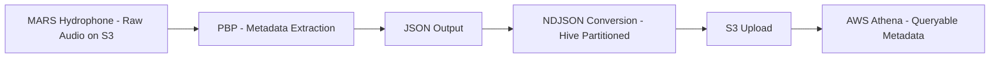

# MBARI Soundscape Metadata Pipeline

[](https://github.com/gabethemyers/mbari_open_soundscape_query/actions/workflows/ci.yml)

This pipeline processes passive acoustic monitoring data from MBARI's MARS hydrophone:
a cabled deep-sea observatory recording continuous broadband audio off the Monterey Bay 
coast. The source dataset, [MBARI Pacific Sound](https://registry.opendata.aws/pacific-sound/), 
has been recorded nearly continuously since July 2015 at 256 kHz resolution and is 
publicly available through the AWS Open Data Registry. This pipeline uses 
[PBP](https://docs.mbari.org/pbp/) to extract hourly soundscape metrics, converts the 
output to Hive-partitioned NDJSON, and uploads results to S3 for large-scale querying 
via AWS Athena. Both a monthly batch pipeline and a daily incremental flow are supported, 
with gap detection and upload validation built in.

## Quick Demo

### 1. Install dependencies

```bash
python3.11 -m venv venv && source venv/bin/activate
pip install -e .  # or: pip install -r requirements.txt
aws configure
```

`aws configure` sets up your AWS credentials so `boto3` can access S3 and Athena.

### 2. Run the monthly batch pipeline

```bash
python -m mbari_soundscape_pipeline.run_meta_gen
```

Or use the installed CLI command:

```bash
run-meta-gen
```

Processes all months in `MONTH_RANGES` (default: the full historical archive). Runs 8
months in parallel. Each month takes ~20 minutes on EC2 (~40 minutes on local hardware),
so a full backfill of ~10 years completes in a few hours with the parallelism. Progress
is tracked in `status.json` — interrupted runs resume where they left off.

### 3. Run a single-day incremental update

```bash
python -m mbari_soundscape_pipeline.daily_metadata --date 2025-04-05
```

Or use the installed CLI command:

```bash
daily-metadata --date 2025-04-05
```

Processes one day's audio through PBP, converts to NDJSON, and uploads. Completes in
under a minute. If `--date` is omitted, the script processes yesterday's date.

### 4. Validate metadata coverage

```bash
python -m mbari_soundscape_pipeline.compare_s3_bucket_counts
```

Or use the installed CLI command:

```bash
compare-s3-bucket-counts
```

Compares source audio file counts against Athena metadata records year by year. Expected
output looks like:

```
Year  Source Audio Files (Valid)  Athena Metadata Records  Diff
----  --------------------------  -----------------------  ----
2015                       20836                    20966  +130
2016                       48330                    48480  +150
2017                       51955                    51965   +10
2018                       50383                    50388    +5
2019                       50645                    50651    +6
2020                       50602                    50649   +47
2021                       50279                    50282    +3
2022                       50596                    50603    +7
2023                       49869                    49909   +40
2024                       36644                    36650    +6
2025                       36192                    36182   -10
2026                       16709                    16649   -60

Source Audio Files (Valid) exclude fragmented .wav files smaller than 50 MB.
Total source audio files (valid, non-fragmented): 513040
Total Athena metadata records: 513374
Total diff: +334
```

A near-zero diff indicates complete coverage. The small positive diff is expected and
attributable to fragmented audio files below the 50 MB validity threshold and a handful
of processing edge cases — the pipeline achieves **99.94% coverage**.

## Pipeline Overview



## Pipeline Modes


## What Lives Here

- `mbari_soundscape_pipeline/` — all pipeline scripts and utilities:
  - `run_meta_gen` — full monthly pipeline from raw audio to NDJSON and S3 upload.
  - `compare_s3_bucket_counts` — yearly source-vs-metadata comparison against Athena.
  - `convert_to_ndjson` — standalone JSON array to NDJSON converter.
  - `daily_metadata` — daily metadata generation and upload flow.
- `pyproject.toml` — project metadata and dependencies (see [docs/pyproject.md](docs/pyproject.md)).

### CLI Commands

After installing with `pip install -e .`, these CLI commands are available:

- `convert-to-ndjson <input_dir> <output_dir>` — convert PBP JSON arrays to NDJSON.
- `compare-s3-bucket-counts` — compare S3 source counts vs Athena metadata coverage.
- `run-meta-gen` — run the full monthly batch pipeline.
- `daily-metadata --date YYYY-MM-DD` — generate metadata for a single day.

## Documentation

Each script has its own doc in `docs/`:

- [`docs/README.md`](docs/README.md)
- [`docs/run_meta_gen.md`](docs/run_meta_gen.md)
- [`docs/compare_s3_bucket_counts.md`](docs/compare_s3_bucket_counts.md)
- [`docs/convert_to_ndjson.md`](docs/convert_to_ndjson.md)
- [`docs/daily_metadata.md`](docs/daily_metadata.md)

## Importing

The package can be imported as `mbari_soundscape_pipeline`:

```python
from mbari_soundscape_pipeline.convert_to_ndjson import convert_file
```

Individual modules can also be imported directly:

```python
from mbari_soundscape_pipeline import run_meta_gen
from mbari_soundscape_pipeline import daily_metadata
from mbari_soundscape_pipeline import compare_s3_bucket_counts
```

## Requirements

- Python 3.11
- AWS credentials with S3 read/write and Athena query execution permissions
- `mbari-pbp` installed via `pip install -e .` or `pip install -r requirements.txt`

## Output Layout

- `json/iclisten/` — PBP JSON output
- `ndjson/` — hive-partitioned NDJSON output
- `output/` — monthly PBP logs (created by PBP)
- `logs/` — pipeline run logs including `daily_metadata.log`
- `status.json` — progress tracker for the monthly pipeline
- `daily_metadata/json/` — daily PBP JSON output
- `daily_metadata/logs/` — daily PBP logs (created by PBP)

## CI

Continuous integration runs on every push and pull request to `main`:

- Syntax check (`py_compile`) on all project scripts
- `pytest` (no tests yet — add to `tests/` to start using it)
- Tested on Python 3.11

## Contributions

Identified a silent-halt bug in `pbp meta-gen` triggered by missing source files
  in non-contiguous date ranges, affecting a significant portion of the historical
  archive. Reported as [issue #116](https://github.com/mbari-org/pbp/issues/116);
  the fix was implemented by mentor Danelle Cline, validated through pipeline testing
  on this project, and merged into PBP main via [PR #117](https://github.com/mbari-org/pbp/pull/117).

## Acknowledgments

Developed as part of a collaboration between CSUMB and MBARI under mentor Danelle Cline.
