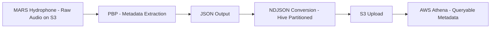
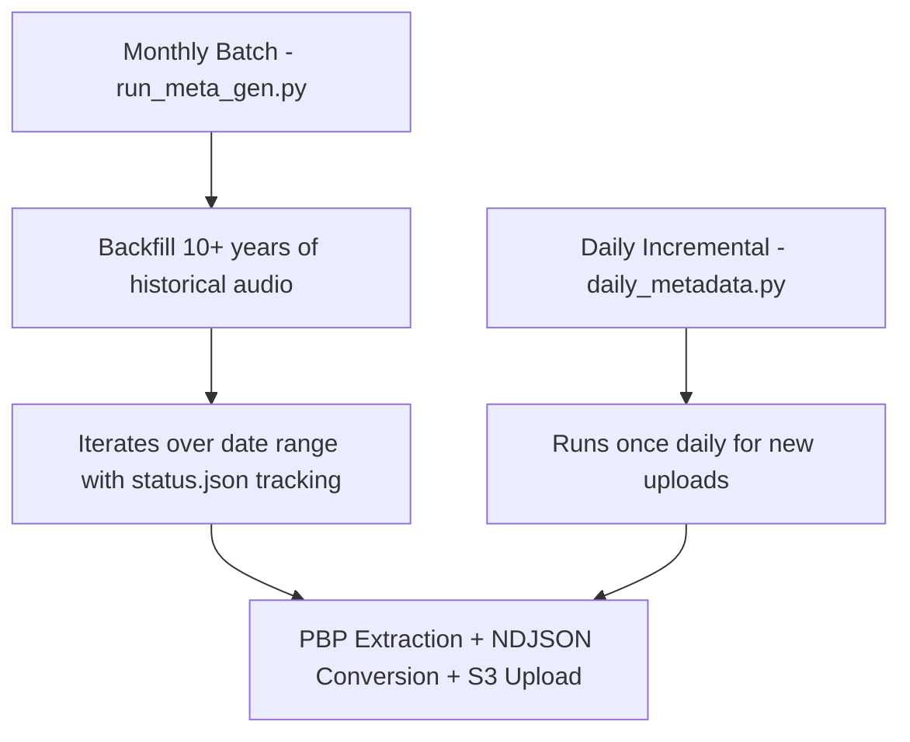

# MBARI Soundscape Metadata Pipeline

This pipeline processes passive acoustic monitoring data from MBARI's MARS hydrophone:
a cabled deep-sea observatory recording continuous broadband audio off the Monterey Bay 
coast. The source dataset, [MBARI Pacific Sound](https://registry.opendata.aws/pacific-sound/), 
has been recorded nearly continuously since July 2015 at 256 kHz resolution and is 
publicly available through the AWS Open Data Registry. This pipeline uses 
[PBP](https://docs.mbari.org/pbp/) to extract hourly soundscape metrics, converts the 
output to Hive-partitioned NDJSON, and uploads results to S3 for large-scale querying 
via AWS Athena. Both a monthly batch pipeline and a daily incremental flow are supported, 
with gap detection and upload validation built in.


## Pipeline Overview



## Pipeline Modes



## What Lives Here

- `run_meta_gen.py` — full monthly pipeline from raw audio to NDJSON and S3 upload.
- `compare_s3_bucket_counts.py` — yearly source-vs-metadata comparison against Athena.
- `convert_to_ndjson.py` — standalone JSON array to NDJSON converter.
- `daily_metadata/daily_metadata.py` — daily metadata generation and upload flow.

## Documentation

Each script has its own doc in `docs/`:

- `docs/README.md`
- `docs/run_meta_gen.md`
- `docs/compare_s3_bucket_counts.md`
- `docs/convert_to_ndjson.md`
- `docs/daily_metadata.md`

## Requirements

- Python 3.11
- AWS credentials with S3 read/write and Athena query execution permissions
- `mbari-pbp` installed from `requirements.txt`

## Setup

```bash
python3.11 -m venv venv
source venv/bin/activate
pip install -r requirements.txt
```

## Output Layout

- `json/iclisten/` — PBP JSON output
- `ndjson/` — Hive-partitioned NDJSON output
- `output/` — PBP logs
- `logs/` — pipeline logs
- `status.json` — progress tracker for the monthly pipeline

## Contributions

Identified a silent-halt bug in `pbp meta-gen` triggered by missing source files
  in non-contiguous date ranges, affecting a significant portion of the historical
  archive. Reported as [issue #116](https://github.com/mbari-org/pbp/issues/116);
  the fix was implemented by mentor Danelle Cline, validated through pipeline testing
  on this project, and merged into PBP main via [PR #117](https://github.com/mbari-org/pbp/pull/117).

## Common Commands

```bash
python run_meta_gen.py
python compare_s3_bucket_counts.py
python convert_to_ndjson.py <input_dir> <output_dir>
python daily_metadata/daily_metadata.py --date 2025-04-05
```

## Acknowledgments

Developed as part of a collaboration between CSUMB and MBARI under mentor Danelle Cline.
